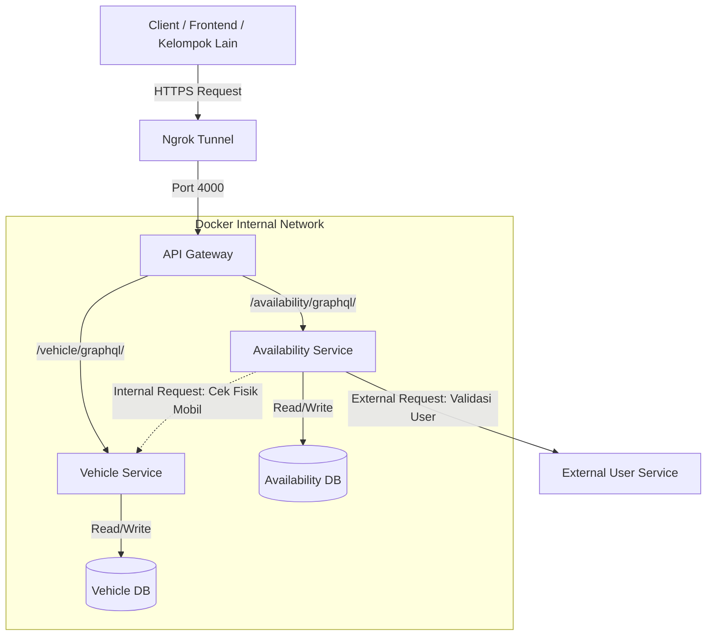

# 🚗 Fleet Management System (Microservices)

Sistem manajemen penyewaan kendaraan berbasis **Microservices Architecture**. Sistem ini menangani inventaris kendaraan (*Vehicle Service*) dan penjadwalan peminjaman (*Availability Service*), yang disatukan melalui **API Gateway** terpusat.

Sistem ini dibangun untuk memenuhi tugas besar integrasi sistem, mencakup autentikasi JWT, validasi lintas layanan, dan integrasi dengan layanan eksternal.


## 🏗️ Architecture Design

Sistem menggunakan pola **API Gateway** sebagai pintu masuk tunggal (Single Entry Point).


<br />

## 🚀 Key Features

1.  **API Gateway**
    Routing terpusat. Client hanya perlu satu URL untuk mengakses semua layanan.

2.  **JWT Authentication (SSO)**
    Login satu kali di *Vehicle Service*, token valid digunakan di *Availability Service* (Shared Secret Key).

3.  **Race Condition Handling**
    Mencegah *double booking* (dua user membooking mobil dan tanggal yang sama) menggunakan Database Constraint.

4.  **External Integration**
    Integrasi dengan API kelompok lain untuk memvalidasi reputasi User sebelum booking.

5.  **Microservices Isolation**
    Pemisahan database dan logika bisnis antara data fisik kendaraan dan jadwal booking.

<br />

## 🛠️ Tech Stack

* **Language:** Python 3.9
* **API Interface:** GraphQL (Ariadne)
* **Web Framework:** FastAPI (Gateway & Service Wrapper)
* **Database:** PostgreSQL
* **Infrastructure:** Docker & Docker Compose
* **Networking:** Ngrok (Public Tunneling)

<br />

## ⚙️ Installation & Setup

### Prerequisites
Pastikan Anda sudah menginstall:
* Docker Desktop & Docker Compose
* Ngrok

### 1. Clone Repository
```bash
git clone {repo_url}.git
cd Proyek-Tubes
```

### 2. Run Application
Jalankan perintah berikut untuk membangun image dan menjalankan container:
```bash
docker-compose up --build
```
*Tunggu hingga semua service (Gateway, Vehicle, Availability, DB) berstatus "Healthy" atau Running.*

### 3. Expose to Public (Ngrok)
Buka terminal baru, jalankan Ngrok pada **Port 4000** (Port Gateway):
```bash
ngrok http 4000
```
Salin URL HTTPS yang muncul (contoh: `https://{ngrok_domain}`). Ini adalah **Base URL** Anda.

<br />

## 📖 API Documentation

**Base URL:** `https://{ngrok_domain}`

> **⚠️ PENTING:** Endpoint GraphQL mewajibkan tanda **garis miring (/)** di akhir URL.

### 🔐 Authentication Header
Beberapa fitur membutuhkan token (Private). Token didapatkan dari mutation `login`.
**Format Header:**
```json
{{
  "Authorization": "Bearer <YOUR_ACCESS_TOKEN>"
}}
```

---

### 🚙 Vehicle Service
**Endpoint:** `/vehicle/graphql/`

#### 1. Login Admin (Get Token)
Gunakan ini untuk mendapatkan Access Token.
```graphql
mutation {{
  login(username: "admin", password: "admin123") {{
    access_token
    token_type
  }}
}}
```

#### 2. Get All Vehicles (Public)
Melihat daftar mobil beserta status fisiknya.
```graphql
query {{
  getAllVehicles {{
    id
    model
    plateNumber
    price
    status
  }}
}}
```

#### 3. Add Vehicle (Private - Admin Only)
Menambah armada baru ke database.
```graphql
mutation {{
  addVehicle(plateNumber: "B 1234 TES", model: "Tesla Model 3", price: 500000) {{
    id
    model
    status
  }}
}}
```

#### 4. Update Vehicle Status (Private - Admin Only)
Mengubah status fisik mobil (Contoh: `ACTIVE`, `MAINTENANCE`, `SOLD`).
```graphql
mutation {{
  updateVehicle(id: 1, status: "MAINTENANCE") {{
    id
    model
    status
  }}
}}
```

---

### 📅 Availability Service
**Endpoint:** `/availability/graphql/`

#### 1. Check Availability (Public)
Validasi apakah mobil tersedia pada tanggal tertentu (belum dibooking dan mobil dalam kondisi prima).
```graphql
query {{
  checkAvailability(vehicleId: 1, date: "2025-12-31")
}}
```

#### 2. Lock Schedule / Booking (Private)
Melakukan booking. Service ini akan otomatis:
* Mengecek fisik mobil ke *Vehicle Service* (Internal).
* Mengecek validitas user ke *External User Service* (Kelompok Lain).
* Menyimpan jadwal jika valid dan mencegah *double booking*.

```graphql
mutation {{
  lockSchedule(vehicleId: 1, date: "2025-12-31", userId: "1") {{
    id
    vehicleId
    date
    isLocked
    status
  }}
}}
```

#### 3. Get All Schedules (Private)
Melihat semua jadwal booking yang tercatat di sistem.
```graphql
query {{
  getAllSchedules {{
    id
    vehicleId
    date
    userId
  }}
}}
```

<br />

## 🧪 Testing Guidelines (GraphQL Playground)

Anda dapat melakukan testing langsung melalui Browser karena Gateway sudah mengaktifkan GraphQL Playground.

1.  **Login:** Buka `base_url/vehicle/graphql/` -> Jalankan mutation `login` -> Copy Token.
2.  **Pindah Service:** Buka `base_url/availability/graphql/`.
3.  **Set Auth:** Klik **HTTP HEADERS** di bagian bawah kiri, paste token:
    ```json
    {{ "Authorization": "Bearer <paste_token_here>" }}
    ```
4.  **Eksekusi:** Jalankan mutation `lockSchedule`.

<br />

## 📂 Project Structure

```bash
.
├── api_gateway/            # Logic Gateway & Routing (FastAPI Proxy)
│   ├── main.py
│   ├── Dockerfile
│   └── requirements.txt
├── vehicle_service/        # Service Katalog & Auth (Vehicle Logic)
│   ├── main.py
│   ├── models.py
│   ├── schema.graphql
│   └── Dockerfile
├── availability_service/   # Service Jadwal & Booking (Availability Logic)
│   ├── main.py
│   ├── models.py
│   ├── schema.graphql
│   └── Dockerfile
├── docker-compose.yml      # Konfigurasi Orkestrasi Container
└── README.md               # Dokumentasi Proyek
```
